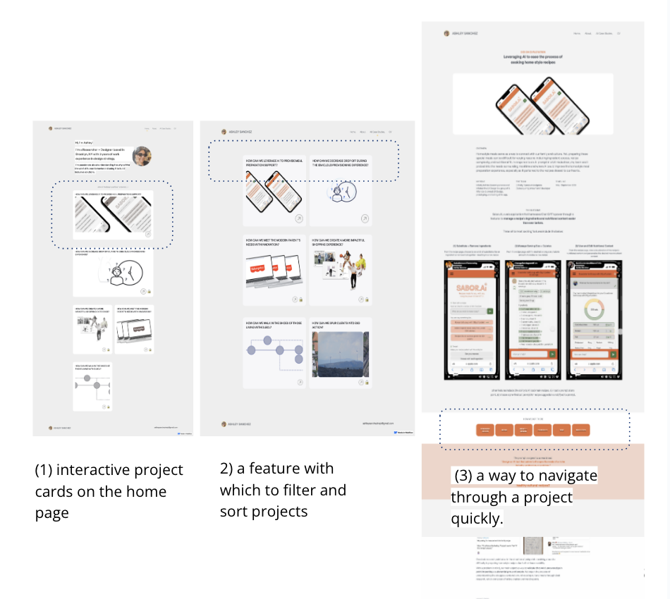

# FP1 - Proposal for Critique

What is the basic idea of the final project?

    1. Idea 1:
    The main purpose of the app is to help users find and modify recipes to best tailor their preferences and nutritional needs.

    /Users/ashs/Documents/GitHub/pui-homework-template/final-project/Idea-1.png

    The end goal is to create an interactive interface that simulates the use of AI to:
    (1) load a recipe from a home page 
    (2) allow the user to substitute/remove an ingredient from a recipe and 
    (3) allow the user to visualize the nutritional content of their recipe. 

    2. Idea 2:

    The main purpose of this project is to automate the updating of events for a non-profit’s Squarespace site. 

    The end goal would be to (1) create a template for the non-profit to input an image, time, copy, etc. and have that event auto-populate on their website (2) create a page that shows an overview of the events and (3) create a page that shows a detail of the event and allows the user to sign up for it. 

    /Users/ashs/Documents/GitHub/pui-homework-template/final-project/Idea-2.png

    3. Idea 3:

    The main purpose of this project is to make my portfolio more scannable, interactive, and overall fun to use. 
    The end goal is to create (1) interactive project cards on the home page, (2) a feature with which to filter and sort projects and (3) a way to navigate through a project quickly. 

    

How you plan to make your design interactive and engaging.
    I plan to make my design interactive and engaging through microinteractions such as button animations, animated transitions, and interactive icons. 

How you plan to make your design accessible.
    I plan to make my design accessible by ensuring that my application's contrast, text and typography, and navigation are accessible. As a way to ensure I will ensure that my application is compliant with WCAG guidelines. 

What information do you specifically want to convey and include on your website.
    (Idea 1) The information I want to convey includes a recipe, its nutrition content, and alternative ingredients. 
    (Idea 2) The information I want to convey includes event date/times, images, map location, and descriptions. 
    (Idea 3) The information I want to convery includes the content of my portfolio projects displayed through microinteractions. 

On 0.5 pages (~300 words), summarize all the critiques you received during the lab session. 
    (Idea 1) For Idea 1, the feedback I received revolved around ensuring that the data I use for my design is of high-quality. Other people in my lab shared that they would use a product such as this. The other piece of key feedback revolved around scoping this application correctly - defining what is a "must-have" and what is a "nice-to-have"
    (Idea 2) The feedback revolved around the possibility that this automation project might not focus on the user experience, but rather on backend API calls. 
    (Idea 3) Feedback is to consider how Webflow (where my portfolio is currently hosted) does not 

Add 0.5 pages (~300 words) that digest the feedback you got in the lab. Indicate on which critique you will act on in your next design and why you chose to incorporate/dismiss pieces of critique.
    (Idea 1) I will act on the critiques for my first idea. The critique/advice revolved around (1) using data that is realistic to create an application simulating the use of an LLM to function and (2) Ensuring that the project is scoped correctly to be feasible. 

    Feedback 1, using realistic data, will set up the application to be scaled and integrated with an LLM in the future. By incorporating realistic data, the simulation would appear more believable and align with the expectations of users who are increasingly familiar with AI-driven applications. Realistic data will also enhance user experience by providing a deeper level of engagement and will demonstrate the viability of integrating LLMs in future versions. 

    Feedback 2, ensuring that the flows I will develop are scoped correctly, will also be essential since each flow is complex. By defining a clear scope, I can prioritize the most critical aspects, such as user interaction patterns and realistic simulated responses, while allowing for potential expansions with an LLM API. A clear scope will allow the design of my application to feel robust and intentional, balancing functionality with development constraints.