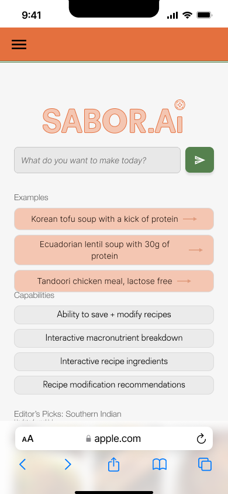
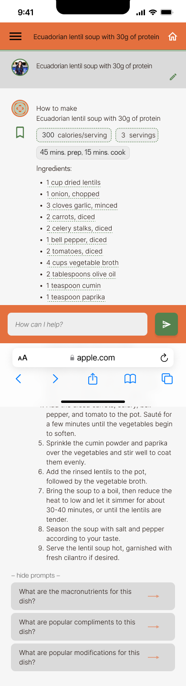

# **FP2 \- Evaluation of the Final project**

## Project Description

My project is a web app that uses LLM to create a recipe that users can interact with on the screen. 

## High-Fi Prototypes

### *Prototype 1*

Description: This is the landing page for my prototype - the page where users will learn about the app and get inspiration for the type of recipe they want to create.

Feedback Summary: It's not clear what a user can do on this page, and the instructions are shaped like disabled buttons. It seems like too much information at once.

//A brief description and summary of the user feedback (\<100 words, 2 images) 

### *Prototype 2*

Description: This is the UI for a recipe. From here, a user can edit the serving size, calorie per serving, and the ingredients. For the purpose of my project, a user will be able to remove an ingredient from the recipe and receive a new recipe.

Feedback Summary: Users could not tell what was clickable -- no one had a mental model where you can edit a recipe from the recipe itself. As such, users were shocked to see what they could do on this UI. 

## Usability Test

Discuss the user feedback you got during the evaluation / usability test (\~300 words). Indicate which feedback you implemented, inspired new directions, or otherwise influenced your final design. 

Three large insights from my usability test:

1) Insight: Users were constantly surprised about what they could do on each screen 
   
   Implication: Set clear expectations for functionality of the application, and enhance affordances for interactable components on each page
   
   Design change: On the home page, (1) I included instructions as to what users can do on the page, broken down by numbered steps (2) I made sure that buttons had the right contrast and that the visual language of each button signified their state (active or inactive). On the recipe page, I ()

2) Insight: Users felt like the application couldn’t be fully trusted to create a strong recipe and update it to reflect their inputs, such as changing an ingredient

    Implication: Show the user that the recipe is being created thoughtfully, and provide more feedback that the app is doing what they want

    Design change: Include interactions that show how a recipe is generated, and for every change that users make to the recipe, highlight the implemented changes

3) Insight: Users felt like every page had too much information and felt overwhelmed to the point where they did not want to use the app anymore

    Implication: Reduce cognitive load for the user at any given point in the flow

    Design change: Break down information through the use of space and instruction. Further, instead of giving users all of the information at once, allow them to expand information to control how much they see at a time

## Updated Designs

 

Summary: Reflects changes in user instruction, updates in accessibility (contrast increased for buttons), and enhanced affordances for buttons.

 

Summary:  Reflects changes in the affordances provided for buttons - now they have a textbox to indicate that they are clickable and are in a different color. Also added in an icon to each recipe ingredient to show that the ingredient is editable. 

## Feedback Summary

Summarize the feedback you received in the lab session and discuss how it influenced your design (\~300 words). 

The feedback that I received in the lab session is to ensure that I am using data that will simulate AI generated data so as to make the application believable and scalable for a future integration with an LLM API. Further, I also received instruction to not make my usability testing script too simple so as to not give users too much instruction. 

## Milestones

Outline weekly milestones to plan your expected implementation progress until the end of the semester (\~300 words). 

### *Implementation Plan*

- [ ] Week 9 Oct 28 \- Nov 1:
  - [X] FP1 due
  
- [ ] Week 10 Nov 4 \- Nov 8:  Planning and Landing Page

       [ ] Start up
            Set up the project repository and version control 
            List all requirements to create the application's flows

        [ ] HTML
            Create a basic HTML structure for the home page

        [ ] CSS
            Set up CSS file
            Style basic layout and typography
            Implement button click functionality
            Create button element + Style button
        
- [ ] Week 11 Nov 11 \- Nov 15:  Recipe Generation
       [ ]  Start up
            Set up development environment
        
       [ ]  Implement preset recipe data structure
            Create a JavaScript file to store preset recipes
            Build the recipe structure as shown in the recipe UI 
        
        [ ] Create recipe generation function
            Implement a function that selects a recipe from preset data
            Test the function to ensure it works correctly
        
       [ ]  Connect button to recipe generation
            Add event listener to button
            Call recipe generation function on click

- [ ] Week 12 Nov 18 \- Nov 22: Recipe Generation + Editing 

         [ ]Create recipe display component
            Design layout for recipe display
            Implement component structure to show recipe name, ingredients, and instructions
        
        [ ] Render recipe data
            Parse and display selected recipe information
        
         [ ]Ingredient removal UI
            Create remove buttons for each ingredient
            Style ingredient list
        
         [ ]Implement ingredient removal logic
            Create a function to update recipe by removing an ingredient
            Update recipe state on ingredient removal

- [ ] Week 13 Nov 25 \- Nov 29: Recipe Update + Refinement
         [ ]Refine recipe update functionality
            Ensure the update_recipe function works correctly with the preset data

        [ ] Implement UI update after ingredient removal
            Update the displayed recipe when an ingredient is removed
            Ensure smooth transition and clear user feedback

        [ ] Add loading states and error handling

  - [ ] Thanksgiving  
- [ ] Week 14 Dec 2 \- Dec 6:  
        [ ] Conduct flow testing
            Test recipe generation flow
            Test ingredient removal flow

        [ ] Perform accessibility checks
            Test with screen readers
            Fix identified issues

        [ ] Resolve any bugs found during testing
            Cross-browser testing
            Test on different browsers and devices

### *Libraries and Other Components*

List the JS libraries and other components (if applicable) that you plan to use. 
* JS Libraries I plan to use:
    - A graphics library such as p5.js that allows developers to make very interactive experiences
    - A library that helps with data fetching, such as React Query
    - An input library to get user input such as React Select

## Generative AI Use Plan

Outline how you plan to use Generative AI tools to aid in the implementation (\~300 words).

### *Tool Use*

 What would you use? Edit the list given your plan. For each tool, explain briefly on what do you expect Generative AI to help you with and what might it not be able to help you with.

* ChatGPT + Perplexity.ai
  * I intend to use the above tools to guide me on how to:
    - best structure my code based on my goal to later integrate the app with an API
    - guide me on how to create reusable code to later scale the app's functionality
    - select libraries that work to create the animations I want to include
    - debug problem areas that I am stuck on
    - consider accessibility guidelines at every step of my design
    - consider how to best structure my workflow prioritization to be efficient in my development
  * I will not use the above tools for creating actual code to implement because: 
    - it will not help build a strong, scalable foundational base code for my application
    - I believe it will limit my creativity when problem solving because it might discourage me to explore with novel, creative interaction patters

### *Responsible Use*

How would you use Generative AI responsibly? 
* By citing how Gen AI supported my code development and using AI to ensure my design is inclusive and accessible. 

# FP1 - Proposal for Critique

What is the basic idea of the final project?

    1. Idea 1:
    The main purpose of the app is to help users find and modify recipes to best tailor their preferences and nutritional needs.

    /Users/ashs/Documents/GitHub/pui-homework-template/final-project/Idea-1.png

    The end goal is to create an interactive interface that simulates the use of AI to:
    (1) load a recipe from a home page 
    (2) allow the user to substitute/remove an ingredient from a recipe and 
    (3) allow the user to visualize the nutritional content of their recipe. 

    2. Idea 2:

    The main purpose of this project is to automate the updating of events for a non-profit’s Squarespace site. 

    The end goal would be to (1) create a template for the non-profit to input an image, time, copy, etc. and have that event auto-populate on their website (2) create a page that shows an overview of the events and (3) create a page that shows a detail of the event and allows the user to sign up for it. 

    /Users/ashs/Documents/GitHub/pui-homework-template/final-project/Idea-2.png

    3. Idea 3:

    The main purpose of this project is to make my portfolio more scannable, interactive, and overall fun to use. 
    The end goal is to create (1) interactive project cards on the home page, (2) a feature with which to filter and sort projects and (3) a way to navigate through a project quickly. 

    

How you plan to make your design interactive and engaging.
    I plan to make my design interactive and engaging through microinteractions such as button animations, animated transitions, and interactive icons. 

How you plan to make your design accessible.
    I plan to make my design accessible by ensuring that my application's contrast, text and typography, and navigation are accessible. As a way to ensure I will ensure that my application is compliant with WCAG guidelines. 

What information do you specifically want to convey and include on your website.
    (Idea 1) The information I want to convey includes a recipe, its nutrition content, and alternative ingredients. 
    (Idea 2) The information I want to convey includes event date/times, images, map location, and descriptions. 
    (Idea 3) The information I want to convery includes the content of my portfolio projects displayed through microinteractions. 

On 0.5 pages (~300 words), summarize all the critiques you received during the lab session. 
    (Idea 1) For Idea 1, the feedback I received revolved around ensuring that the data I use for my design is of high-quality. Other people in my lab shared that they would use a product such as this. The other piece of key feedback revolved around scoping this application correctly - defining what is a "must-have" and what is a "nice-to-have"
    (Idea 2) The feedback revolved around the possibility that this automation project might not focus on the user experience, but rather on backend API calls. 
    (Idea 3) Feedback is to consider how Webflow (where my portfolio is currently hosted) does not 

Add 0.5 pages (~300 words) that digest the feedback you got in the lab. Indicate on which critique you will act on in your next design and why you chose to incorporate/dismiss pieces of critique.
    (Idea 1) I will act on the critiques for my first idea. The critique/advice revolved around (1) using data that is realistic to create an application simulating the use of an LLM to function and (2) Ensuring that the project is scoped correctly to be feasible. 

    Feedback 1, using realistic data, will set up the application to be scaled and integrated with an LLM in the future. By incorporating realistic data, the simulation would appear more believable and align with the expectations of users who are increasingly familiar with AI-driven applications. Realistic data will also enhance user experience by providing a deeper level of engagement and will demonstrate the viability of integrating LLMs in future versions. 

    Feedback 2, ensuring that the flows I will develop are scoped correctly, will also be essential since each flow is complex. By defining a clear scope, I can prioritize the most critical aspects, such as user interaction patterns and realistic simulated responses, while allowing for potential expansions with an LLM API. A clear scope will allow the design of my application to feel robust and intentional, balancing functionality with development constraints.